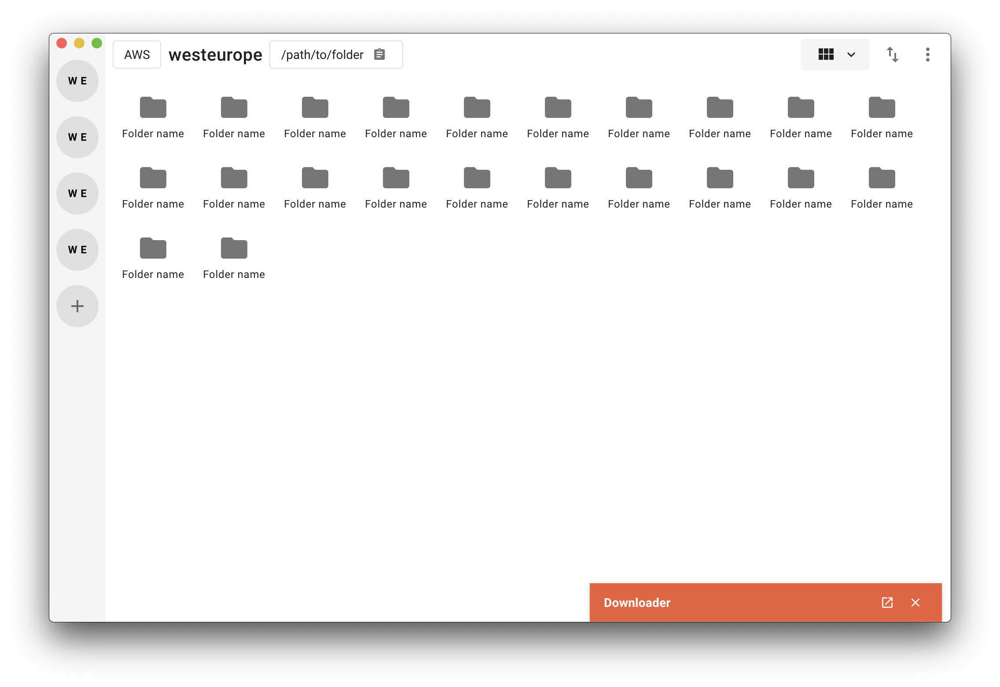

# dbfs_explorer

> DBFS Explorer for Databricks 



#### Build Setup

``` bash
# install dependencies
yarn install

# serve app with hot reload
yarn run dev

# build electron application for production
yarn run build

# yarn tests
yarn test


# lint all JS/Vue component files in `src/`
yarn run lint

```

---

This project was generated with [electron-nuxt](https://github.com/michalzaq12/electron-nuxt) v1.5.0 using [vue-cli](https://github.com/vuejs/vue-cli). Documentation about the original structure can be found [here](https://github.com/michalzaq12/electron-nuxt/blob/master/README.md).
